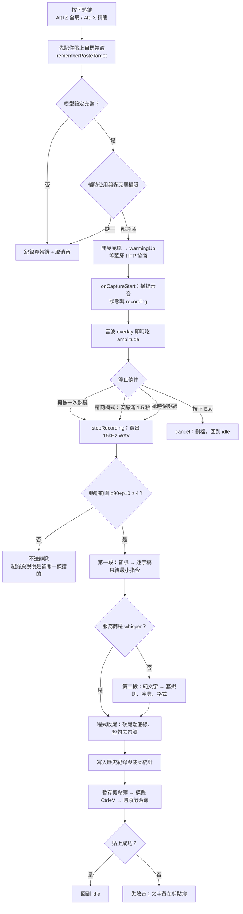
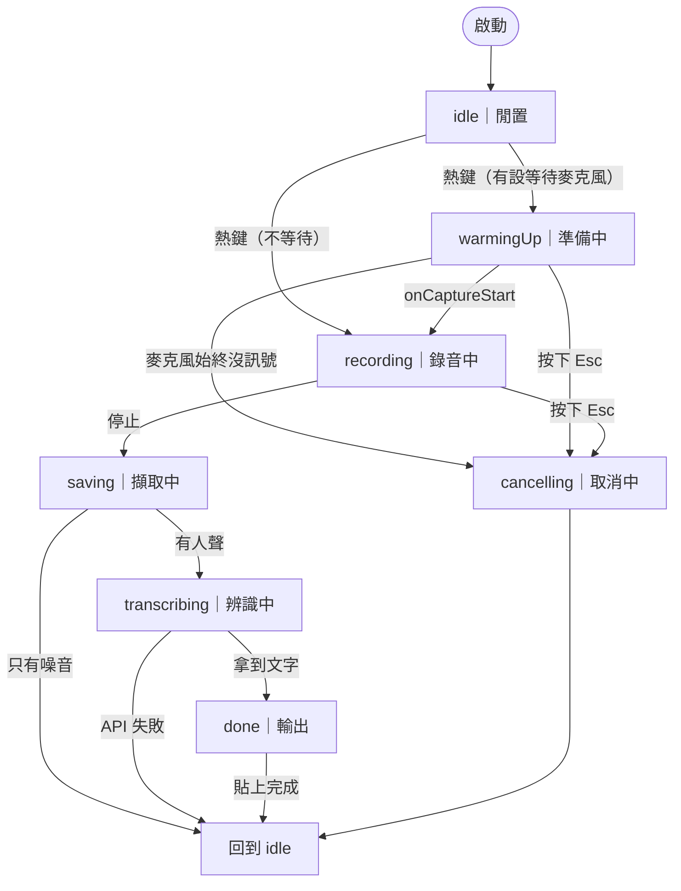
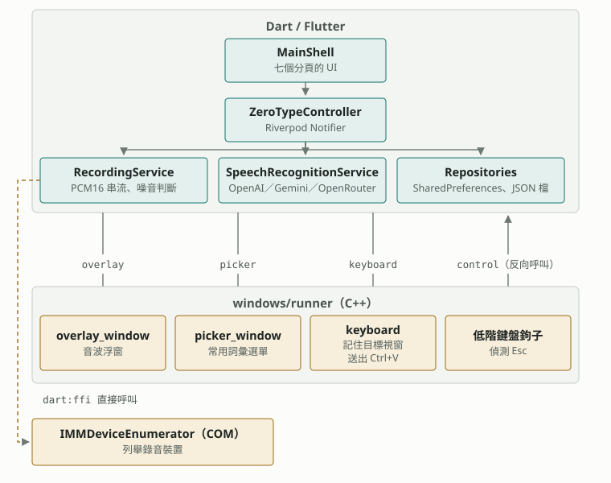

# ZeroType 運作解剖

> 一次語音輸入從按下熱鍵到文字落在游標處，中間經過哪些關卡。以及這個專案用到了 Flutter 的哪些特性。

`45 個 Dart 檔`　`5 條 MethodChannel`　`3 組全域熱鍵`　`2 段 API 呼叫`　`Windows only`

---

## 一次輸入的完整流程

整條路徑由 `ZeroTypeController` 驅動。它是一顆 Riverpod `Notifier`，全部的分支都收斂在同一個狀態物件上。

*圖 1　`lib/core/controllers/zero_type_controller.dart`*

四個關鍵：

1. **順序不能換。** 貼上目標必須在任何視窗操作之前記下來。晚一步，記到的就不是使用者原本那個視窗。
2. **只有噪音就不送。** 空錄音送給 AI，它不會回「沒聽到」，而是編一整段內容出來。門檻看動態範圍，不看音量。
3. **兩段式呼叫。** 規則、範例與字典跟音訊放在同一個 context，模型會照抄。所以音訊那段只給一句指令，其餘全部移到第二段純文字。
4. **剪貼簿是借用的。** 貼上後還原成使用者原本複製的東西。貼上失敗時不還原，那時剪貼簿是唯一的救援手段。

---

## 狀態機

八個狀態都在 `ZeroTypeStatus`。控制器覆寫了 `state` 的 setter，把系統匣圖示與 Esc 熱鍵的武裝旗標掛在狀態轉換上，而不是掛在畫面上。視窗隱藏時畫面不會重繪，掛在畫面上的東西就不會跑。

*圖 2　`lib/core/state/zero_type_state.dart`*

---

## 分層：Dart 那一半與 C++ 那一半

這個 app 有相當份量的程式碼不在 Flutter 裡。畫面、狀態與 API 呼叫在 Dart；搶焦點的浮窗、鍵盤注入與低階鍵盤鉤子在 `windows/runner` 的 C++。兩邊用 MethodChannel 講話，另有一條 `dart:ffi` 直接呼叫 COM。

> 圖檔另存為 [`architecture-layers.svg`](architecture-layers.svg)，可單獨開啟放大看。

*圖 3　`lib/` 與 `windows/runner/`（permission 那條未畫）*

---

## Flutter 的特性，對照這個專案

Flutter 是 Google 的 UI 框架，語言是 Dart。以下每一條先講框架本身，再指出它在 ZeroType 的哪個位置。

### 自繪 UI，不是包網頁

Flutter 不用系統原生控制項，也不用 WebView。它自己在一張畫布上把每一個像素畫出來。所以同一份程式碼在各平台長得一樣，也不受系統控制項的限制。

> **在 ZeroType 裡**：標題列被關掉（`TitleBarStyle.hidden`），最小化與關閉按鈕是自己畫的 widget。

### 宣告式 UI

你不去改畫面，你描述「這個狀態下畫面長什麼樣」。狀態一變，框架重建那棵 widget 樹，並且只把真正變動的部分畫出來。

> **在 ZeroType 裡**：錄音音量 `amplitude` 每次更新都寫進狀態物件。畫面自己跟著動，沒有一行「把音波條設成 0.7」的程式碼。

### 狀態管理靠套件

Flutter 只提供最基本的 `setState`。跨畫面的狀態要自己選方案。Riverpod 是常見的一種：狀態放在 provider，需要的 widget 自己去 watch。

> **在 ZeroType 裡**：熱鍵在任何頁面按下都有效，因為 `zeroTypeControllerProvider` 不屬於任何一個頁面。歷史頁靠 `ref.invalidate` 重讀。

### 單執行緒事件迴圈

Dart 預設只有一條執行緒。`async` 與 `await` 不開新執行緒，只是把工作排進事件迴圈。等 API 回應時畫面不會卡，但一段很花時間的純運算會卡。要真的平行就得開 Isolate。

> **在 ZeroType 裡**：API 呼叫、音效播放與 overlay 更新全都用 `unawaited` 放行，不擋住錄音啟動。噪音分析在錄音結束後才做，量夠小，不必開 Isolate。

### Platform Channel（原生橋接）

Dart 做不到的事，交給平台原生程式碼。兩邊用具名的 channel 互傳訊息，可以雙向呼叫。

> **在 ZeroType 裡**：五條 channel — overlay、keyboard、permission、picker、control。`control` 是反向的：C++ 的鍵盤鉤子偵測到 Esc，主動呼叫 Dart 的 `cancel`。

### dart:ffi（原生橋接）

另一條路。FFI 讓 Dart 直接呼叫 C 函式，不必寫任何橋接程式碼，也不必經過 channel。`win32` 這個套件就是整包 Windows API 的 FFI 綁定。

> **在 ZeroType 裡**：列舉錄音裝置直接在 Dart 呼 COM。要小心的是記憶體：`IMMDevice` 這類物件自帶 Finalizer，再手動釋放一次會在之後某次 GC 讓程序無聲崩掉。

### 桌面版的 runner 是真的原生專案

Flutter 桌面 app 的外殼是一個可以自己改的 C++ 專案。Flutter 只是被嵌進其中一個視窗。你可以在旁邊自己開別的視窗。

> **在 ZeroType 裡**：音波浮窗與常用詞彙選單都是手寫的 Win32 視窗，不是 Flutter widget。它們需要「不搶焦點」與「置頂」，這是 Flutter 視窗給不了的。

### Hot reload

改完 Dart 存檔，畫面即時更新，狀態還在。這是開發期最有感的一項。但它只涵蓋 Dart — 改到 `windows/runner` 的 C++ 就要整包重建。

> **在 ZeroType 裡**：UI 調整很快。動到 overlay 或鍵盤注入就得重跑 `flutter build windows`。

### 套件生態

pub.dev 上的套件補齊了框架不做的事。桌面相關的套件多半由社群維護，成熟度不一。

> **在 ZeroType 裡**：`record` 錄音、`hotkey_manager` 全域熱鍵、`window_manager` 視窗、`tray_manager` 系統匣、`dio` HTTP、`shared_preferences` 設定。

### AOT 編譯

Release build 把 Dart 編成原生機器碼，不帶直譯器。啟動快，執行速度接近原生。代價是輸出資料夾比較大，而且沒有安裝檔的概念 — build 完就是更新完。

> **在 ZeroType 裡**：要確認執行的是不是最新版，比對的是 `app.so` 與 `flutter_assets` 的時間戳，不是 `zero_type.exe`。

---

## 抽象漏出來的地方

「一份程式碼到處跑」在桌面上是有代價的。這個專案付過的：

- **工作列圖示換色做不到。** 可以把圖示設進去，但 shell 不重畫。快取、DestroyIcon、tray_manager 的順序都排除了，剩下的路只有 ITaskbarList3。
- **剪貼簿只讀得到純文字。** Flutter 的 `Clipboard` 沒有其他格式。使用者原本複製的是圖片或檔案就救不回來。要全格式得回到 C++ 用 EnumClipboardFormats。
- **單獨一顆 Win 鍵當熱鍵是死路。** 低階鉤子會讓外接鍵盤的 c、h 變成 Win+C、Win+H。熱鍵一律要帶非修飾主鍵。
- **全域 Esc 不能用 RegisterHotKey。** 它會獨佔按鍵，而且熱鍵套件會丟出沒人接的例外，整個程式炸掉。改用被動的 `WH_KEYBOARD_LL` 鉤子加旗標。
- **平台差異寫死在程式裡。** `macos/` 已經移除。這是 Windows-only 的 app，跨平台在這裡只剩理論值。

---

*內容取自 2026-09-07 的 master。圖 1、圖 2 由 Mermaid 繪製，圖 3 是內嵌 SVG，都不連任何 CDN。*
